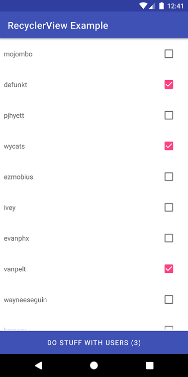
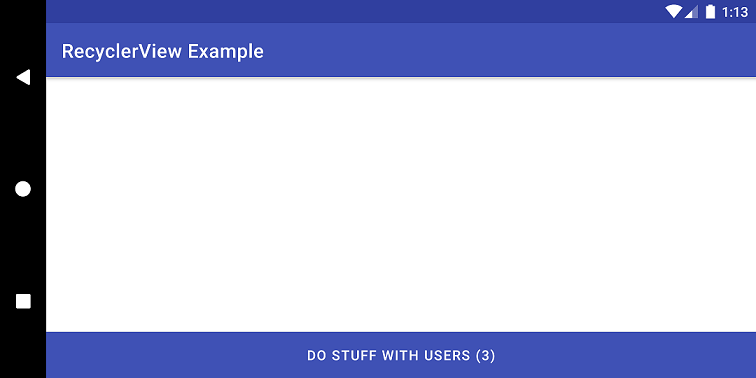

A few months ago, I was washing my dishes while listening to [episode 148 of the Fragmented podcast](https://fragmentedpodcast.com/episodes/148/). In this episode, Donn Felker and Kaushik Gopal talk about architecture. To be specific, about an MVI-like architecture that Kaushik has been using.

This architecture specifies that each screen has one and only one ViewModel, that exposes a single observable to the Activity or Fragment. This observable emits the screen’s state: when an update is required, the observable emits a new state object, which the view uses to update its state. To emit a state update, the ViewModel has to receive an event. Different events trigger different updates. Events then generate results, which generate the state updates. Each event class has a corresponding result class.

There are many other nuances around the architecture, but these are the ones that matter for this article.

### The Epiphany

In the [sample repo](https://github.com/kaushikgopal/movies-usf) that Kaushik provides, you can see this example of a view state class:

```kotlin
data class MSMovieViewState(
    val searchBoxText: String? = null,
    val searchedMovieTitle: String = "",
    val searchedMovieRating: String = "",
    val searchedMoviePoster: String = "",
    val searchedMovieReference: MSMovie? = null,
    val adapterList: List<MSMovie> = emptyList()
)
```

This is quite similar to a [presentation model](https://martinfowler.com/eaaDev/PresentationModel.html), but without the behavior definition. Also, as you can see, the class is immutable. This means that whenever there’s a new state update, the old values get copied into a new object. This new object also has the updated value for each specific state change. For example, given the events class:

```kotlin
sealed class MSMovieEvent {
    object ScreenLoadEvent : MSMovieEvent()
    data class SearchMovieEvent(val searchedMovieTitle: String = "") : MSMovieEvent()
    data class AddToHistoryEvent(val searchedMovie: MSMovie) : MSMovieEvent()
    data class RestoreFromHistoryEvent(val movieFromHistory: MSMovie) : MSMovieEvent()
}
```

for a “add to history event”, you would have something like (this is an oversimplified version of the repo’s code):

```kotlin
val movie: MSMovie = result.packet.movie

val newState = oldState.copy(
  searchedMovieTitle = movie.title,
  searchedMovieRating = movie.ratingSummary,
  searchedMoviePoster = movie.posterUrl,
  searchedMovieReference = movie)
```

When I saw this, my train of thought was more or less like “OK, this looks nice. Every state detail becomes enclosed in the same object. But this also means I have to redraw the whole UI on each update, even if I just change a simple text label. This seems rather heavy…”.

I was really hyped about the architecture, but this bummed me out a little. There must be another way…

And then it dawned on me: “What if I tried to use sealed classes for this?”

### Keep it simple. Also, keep it working correctly

Kaushik makes heavy usage of RxJava in this architecture. I love RxJava and think it’s amazing. Yet, like many, I also think that in most cases it’s an overkill. Especially when the framework already provides similar tools for the most common cases. Instead of using RxJava, I’ll be using LiveData for observability. For async work, I’ll use Coroutines. I also won't be using events or results. Results seem rather redundant when you have observability. As for the events, they also seem to be superfluous: I have methods causing state changes. As such, observability should take care of everything for me, right? Eh, not quite, but we’ll get to that later.

Before I start explaining what I’m about to do, I want to make something clear: I’m not recommending an architecture of any kind. I’m just testing a different approach to an already well defined architecture, and writing about the results. Nothing more. That being said, let’s get started.

I’ll be implementing a Fragment that displays a RecyclerView with a list of user names. Each row has a checkbox that gets checked/unchecked either when you click on it or on the row itself. A button at the bottom of the view will update its label according to the number of selected users. I could’ve picked an even simpler example, but I really wanted to test the limits of this approach.

So, I have two pieces of state here: the contents of the RecyclerView and the button label. I also have the actual user list internal state, i.e., if rows are checked or not. However, since we can consider this as the RecyclerView’s internal state, I’ll let it slide (otherwise, this approach is already failing…).

I came up with the following sealed class:

```kotlin
sealed class RecyclerViewExampleViewState {
  data class UsersListState(val users: List<DisplayedUser>) : RecyclerViewExampleViewState()
  data class ButtonLabelState(val numberOfUsers: String) : RecyclerViewExampleViewState()
  data class PossibleFailureState(val failure: Failure) : RecyclerViewExampleViewState()
}
```

The ViewModel that does all the heavy lifting:

```kotlin
class RecyclerViewExampleViewModel @Inject constructor(
  private val getUsers: GetUsers,
  private val displayedUserMapper: DisplayedUserMapper
) : BaseViewModel() {

  val viewState: LiveData<RecyclerViewExampleViewState>
    get() = _viewState

  private val _viewState: MutableLiveData<RecyclerViewExampleViewState> =
    MutableLiveData()

  init {
    getUsers()
    updateButtonLabel(0)
  }

  fun updateButtonLabel(checkedNumber: Int) {
    val label = if (checkedNumber > 0) " ($checkedNumber)" else ""
    _viewState.value = ButtonLabelState(label)
  }

  private fun getUsers() = getUsers(uiScope, UseCase.None()) {
    it.either(
      ::handleFailure,
      ::handleUserList
    )
  }

  private fun handleFailure(failure: Failure) {
    _viewState.value = PossibleFailureState(failure)
  }

  private fun handleUserList(users: List<User>) {
    val usersToDisplay = users.map { displayedUserMapper.mapToUI(it) }
    _viewState.value = UsersListState(usersToDisplay)
  }
}
```

And the Fragment that updates its view on each state update:

```kotlin
class RecyclerViewExampleFragment
: BaseFragment(), RecyclerViewRowClickListener<DisplayedUser> {

  @Inject
  lateinit var viewModel: RecyclerViewExampleViewModel

  lateinit var adapter: UsersAdapter

  override fun onCreateView(
    inflater: LayoutInflater, container: ViewGroup?,
    savedInstanceState: Bundle?
  ): View? {

    return inflater.inflate(R.layout.fragment_recycler_view_example, container, false)
  }

  override fun onActivityCreated(savedInstanceState: Bundle?) {
    super.onActivityCreated(savedInstanceState)

    progressBarLoading.show()
    setRecyclerView()

    viewModel = createViewModel(this) {
      observe(viewLifecycleOwner, viewState, ::renderViewState)
    }
  }

  private fun setRecyclerView() {
    prepareAdapter()
    recyclerViewUsers.layoutManager = LinearLayoutManager(this.context)
    recyclerViewUsers.adapter = adapter
    recyclerViewUsers.setHasFixedSize(true)
  }

  private fun prepareAdapter() {
    adapter = UsersAdapter(this)
  }

  private fun renderViewState(state: RecyclerViewExampleViewState) {

    when (state) {
      is UsersListState -> renderUserList(state.users)
      is ButtonLabelState -> renderButton(state.numberOfUsers)
      is PossibleFailureState -> renderPossibleFailure(state.failure)
    }
  }

  private fun renderUserList(users: List<DisplayedUser>) {
    progressBarLoading.hide()
    adapter.submitList(users)
  }

  private fun renderButton(selectedUsers: String) {
    buttonDoStuff.text =
      getString(R.string.button_label_do_stuff_with_users, selectedUsers)
    buttonDoStuff.isEnabled = !selectedUsers.isBlank()
  }

  private fun renderPossibleFailure(failure: Failure) {
    // TODO computer says no
  }

  override fun onRowClicked(item: DisplayedUser, position: Int) {
    val checkedNumber = adapter.currentList.filter { it.isChecked }.count()
    viewModel.updateButtonLabel(checkedNumber)
  }

  override fun onDestroyView() {
    super.onDestroyView()
    recyclerViewUsers.adapter = null
  }
}
```

Let me walk you through the code. When the ViewModel inits, it immediately tells the repository to fetch the users (GitHub API). It then updates the button label. The Fragment uses the renderViewState method to observe the LiveData. For each different state update, renderViewState will trigger a different method. The Fragment also implements the RecyclerViewRowClickListener interface. This interface allows us to react to clicks on RecyclerView items. The Fragment does this in the onRowClicked method.

This is the result:



Everything seemingly works as I expected, except for one small (but important) detail. As you may have noticed, the onRowClicked method filters the user list. The filter counts the number of checked rows. Why? Because I can’t use this approach to update state based on a previous state. In other words, because each sealed class is independent. To me, this is the worst disadvantage of using a single LiveData to handle all these state classes: when I create a state update with a certain value, I lose access to it as soon as I set it as the LiveData’s value. Of course, I could always verify the LiveData value on the next state iteration. Unfortunately, I cannot guarantee that the previous update was the one I need. Suddenly, a simple class with the whole state just like Kaushik has seems worth it. Either that or I would need a different LiveData for this specific piece of state. This would also solve the internal RecyclerView state problem I talked about earlier.

Anyway, since the use of another LiveData would solve this, I decided to press on. I wasn’t ready to give up on this sealed classes idea. This time, I rotated the screen. And then this happened:



Dammit. Why?

Well, I forgot a very important aspect of LiveData. Each new observer that subscribes to a LiveData receives its **latest** value. Here, the Fragment gets destroyed on rotation, and a new Fragment starts observing the LiveData. The last value emitted by the LiveData was the button label update. That’s why the label is correct, but the list is empty. If I rotate the phone before clicking on any rows, the list will appear since the getUsers API request is async and finishes after the updateButtonLabel call. On the other hand, the button label will show the placeholder text instead of the correct value.

So, ways to solve this. One possibility is, again, different LiveData variables for each sealed class. This is not the most desirable solution though. If we keep adding new LiveData variables, both code maintenance and testing complexity might increase. This was one of the motives between Kaushik’s architecture, if I recall correctly. Another, more sane possibility is to trigger view state updates in the Fragment’s onResume method or similar. Suddenly, events make sense. The third option I can think of breaks my heart: use a class for the whole state, instead of sealed classes (Sorry Kaushik, I will never doubt your work again).

### Final Thoughts

I ended up using a single class to the whole state . With the LiveData and sealed classes setup, I got to a point where I had a different LiveData for each sealed class, which defeats the purpose of the whole thing. I even had to stop ignoring the RecyclerView’s internal state, since it gets reset on configuration changes.

I’m also using events, although there was no functional need for them in this case: since LiveData will always emit the latest global state for the view, I don’t need to cause an explicit state update on configuration change. Regardless, they do make the code look more structured to me. I like having all state changing events going through the same method. It feels like this should help in keeping things more or less simple on a more complex UI. In the end, the architecture became a simplified version of the one presented in the Fragmented podcast.

Although redrawing the whole UI seems exaggerated, the process is actually very smooth. While this might not hold for a more complex UI, it should be able to handle most cases.

You can find all the code (in its final state) in my [multi module clean architecture template](https://github.com/rcosteira79/AndroidMultiModuleCleanArchTemplate), in the `RecyclerViewExample` module.

As I said before, this is not an architecture recommendation. While this might work for some cases, other alternatives such as databinding or multiple LiveData variables managed by a MediatorLiveData ([as suggested by Gabor Varadi](https://medium.com/@Zhuinden/if-there-are-many-events-id-just-combine-them-together-with-a-mediatorlivedata-or-with-rx-a0494953a578)) might even be a better fit. I’m a fan of this approach, but it’s up to you to figure out what’s best for your specific case.

---

Thank you very much for reading the article. I really hope it was worth it! Do you have any ideas? Would you do something differently? If so, please leave a comment or reach out on Twitter. See you next time!
